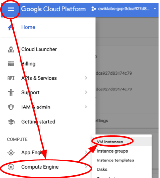
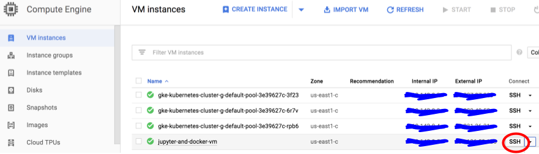

# Jupyter and Docker VM Setup

## Create your VM instance

**Note:** to connect to your remote notebook securely, you will need to install
[Google Cloud SDK](https://cloud.google.com/sdk/) on your machine in order to
configure ssh access to your cloud VM. Make sure you configure your project and
account settings to point to this tutorial project.

Using the cloud sdk locally, setup a new firewall rule to allow ssh tunneling:

```
gcloud compute firewall-rules create allow-ssh --allow=tcp:22
```

Next, ensure that your compute/zone is set from the [GKE setup](GKE_SETUP.md)
step:

```
gcloud config list compute/zone
```

If you need to set it, run:

```
gcloud config set compute/zone <zone>
```

Next, run the following command to create your Jupyter and Docker VM. Give it
extra memory for a later visualization exercise:

gcloud compute instances create jupyter-and-docker-vm \
  --custom-cpu 8 \
  --custom-memory 52 \
  --image-family ubuntu-1604-lts \
  --image-project ubuntu-os-cloud \
  --boot-disk-type pd-standard \
  --boot-disk-size 256GB \
  --scopes cloud-platform \
  --network default \
  --maintenance-policy TERMINATE \
  --restart-on-failure

## Setup the VM environment

From your console, click on the dropdown menu → compute engine → VM instances,
and select the ssh button at the right of your new vm (jupyter-and-docker-vm)
and open in a new window. You may have to click twice (or enable pop-ups) if
your browser blocks pop-ups the first time.




**Run the rest of these commands inside the jupyter-and-docker-vm's ssh pop-up
window:**

Checkout the Tensorflow model directory so we have access to various pre-trained
models. We’re going to use a particular tag v1.4.0 to ensure stability of this
exercise: 

```
git clone https://github.com/tensorflow/models.git
cd models
git checkout v1.4.0
```

Checkout the codelab’s repository and cd into the gcp directory:

```
cd ..
git clone https://github.com/google-aai/tf-serving-k8s-tutorial.git
cd tf-serving-k8s-tutorial/gcp
```

Run the following command to setup Docker (and other text editors for modifying
Dockerfiles) on the vm.  Expect to wait a little while for the command to
complete.

```
sh docker-ubuntu-setup.sh && docker --version
```

Check that the Docker installation completed successfully by seeing that the
last line of the output looks like:

*Docker version x.y.z-ce, build ABCDEFG*

Next, install the Jupyter notebook:

```
sh setup_jupyter_server.sh
```

Note: This script takes about 2 minutes to run. When the script is almost done,
you will be prompted to supply a password for Jupyter. After entering the
password, the script will finish. You will now start a notebook in the
background (If you don’t like messages popping up in your terminal while you
type, you can use a terminal multiplexer such as screen to start the notebook.
This also allows you to keep your notebook alive even if you accidentally close
your VM ssh window.) 

```
cd ~/tf-serving-k8s-tutorial
. ~/.bashrc
nohup jupyter notebook &
```

## Connecting to your Jupyter Notebook

**Run the rest of this locally in command line:**

```
gcloud compute config-ssh
```

After this runs successfully, you will get this back as output:

```
You should now be able to use ssh/scp with your instances.
For example, try running:

  $ ssh [instance-name].[zone-name].[project-name]
```  
  
Run the suggested command to check that ssh works when connecting to your cloud
VM. Then exit the ssh shell by typing `exit`.

Now we are ready to connect to Jupyter! Run the same ssh command again, but this
time, add some flags and ports:

```
ssh -4 -N -f -L localhost:8888:localhost:8888 [instance-name].[zone-name].[project-name]
```

This command basically configures port forwarding, redirecting port 8888 on the
remote cloud VM to your own computer's port 8888. Next, go to your Chrome
browser, and type:

```
localhost:8888
```

If you see a password page for Jupyter, enter your password as prompted.
Once you are in, you can see the notebook view of the directory you
started Jupyter in.

Congratulations! You can now run the exercises on cloud!