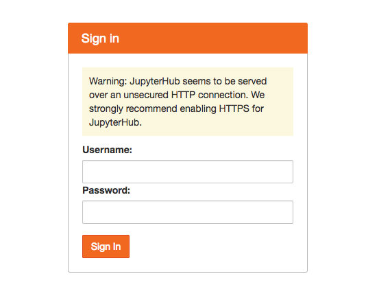
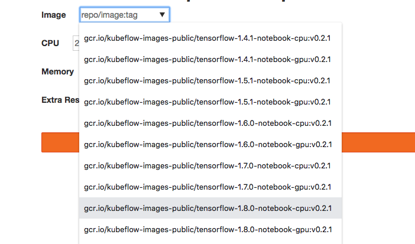

# Deploying Tensorflow Serving using Kubernetes Tutorial

### What this project covers
This project is a tutorial that walks through the steps required to deploy and
[serve a TensorFlow model](https://www.tensorflow.org/serving/serving_basic)
using [Kubernetes (K8s)](https://kubernetes.io/). The latest version runs the
entire exercise on a K8s cluster using [KubeFlow](kubeflow.org).

The key concepts covered in this tutorial are as follows:

* Convert a TensorFlow(TF) graph trained through various APIs into a servable
model
* Serve the model using Tensorflow Serving
* Send online prediction requests to the cluster via a client. Profile latency
and throughput. Experiment with different batch sizes.
* Visualize image pixel contributions to model predictions to explain how the
model sees the world.

## Setup

Before the fun begins, we need to setup our environment and K8s clusters. 

As a developer, it often helps to create a local deployment prior to deploying
on the cloud. We offer some guides on setting up a local K8s cluster, as well
as setting up a cluster on Google Cloud Platform (GCP) below. You can also
experiment with this tutorial on [Amazon EKS](https://aws.amazon.com/eks/) or
[Microsoft AKS]https://azure.microsoft.com/en-us/services/kubernetes-service/).
Feedback is welcomed!

* [Local: Minikube](LOCAL_SETUP.md)
* [Cloud: Google K8s Engine](GKE_SETUP.md)

### Additional Required Software

* [Python 2.7+](https://www.python.org/): The TensorFlow Serving API currently
runs in Python 2, so you will need to make client requests to your model server
using Python 2.
* [Docker](https://www.docker.com/): to build images that can be deployed on K8s
* [Git](https://git-scm.com/): so you can access this project and other projects
* [Pip](https://pip.pypa.io/en/stable/installing/): to install Python packages
required for the tutorial
* [Ksonnet](https://github.com/ksonnet/ksonnet): follow the install instructions
in github

## Deploy KubeFlow onto your cluster

[KubeFlow](kubeflow.org) is always in an active stage of development. For this
exercuse, we will be using a stable tag v0.2.5. Run the following command to deploy
KubeFlow onto your Kubernetes cluster:

```
cd ~
curl https://raw.githubusercontent.com/kubeflow/kubeflow/v0.2.5/scripts/deploy.sh | bash
```

Next, run the following command to check on your pods and services. The services
should be up almost immediately, but pods may take longer to create.

```
kubectl get svc
```

```
kubectl get pods
```

Once your pods are all up and running, continue.

**Troubleshooting:** see [here](TROUBLESHOOTING.md#kubeflow-install).

## Accessing JupyterHub and Spinning up a Notebook


JupyterHub is a popular K8s notebook spawner that can spin up Jupyter
servers on demand for an entire team of data scientists, each server having its
isolated set of customized resources (disk, memory, accelerators).
When a data scientist is finally done training and fine-tuning a model for
production, it is important to be able to export this model for serving. The
following exercises will be running through how to export a model from a local
Jupyter server into a location that K8s can access and serve using the
TensorFlow Serving app.

To access your Jupyter notebook environment, you will need to use port forwarding
from your local computer. 

```
JUPYTER_POD=`kubectl get pods --selector="app=tf-hub" --output=template --template="{{with index .items 0}}{{.metadata.name}}{{end}}"`
kubectl port-forward ${JUPYTER_POD} 8000:8000
```

Go to your browser and access JupyterHub here:

```
localhost:8000
```

You should see a login screen like this:


Type in any username and password to spin up a local environment (Note: if the
username does not exist, a new Jupyter server will be created for that user
with its own isolated resources. If the username already exists, the password
will be required to match the one used to create the server, and you will end up
in the previously created server environment.)

The next page, if you are creating a new environment, should have a drop down
menu with images, and separate CPU, memory, and extra resource text boxes.
In the dropdown menu, select the TensorFlow 1.8 CPU image:



Set CPU and memory to whatever your cluster can handle. 1 CPU and 2Gi memory is
sufficient, but if you are on a cluster and can afford more resources, more CPU
and memory will allow you to spin up and run notebooks faster without having to
shut down notebook kernels. (The minikube setup used above will probably only
allow 1 CPU for Jupyter without interfering with the model serving process.)

The notebook server may take a few minutes to spin up depending on cluster
resources, so be patient. Once it has spun up, go into the work directory,
and upload the local notebook `./jupyter/download_models_and_notebooks.ipynb`
into this directory. In your notebook, run all the cells to download the
Resnet50 models, project notebooks, and library dependencies required for the
next part of this exercise.

## Create a Servable Resnet Model from Estimator and Keras APIs

### Motivation

Your data scientists have used JupyterHub to scale out training and exploration
of datasets, and have finally built a few lovely models that meet performance
requirements. It is now time to serve models live in production! The first step
is to take their trained models, at whatever checkpoint they deem most optimal,
and package it for optimal serving performance using
[TensorFlow Serving](https://www.tensorflow.org/serving/).

As a data scientist or production engineer, it helps to understand how to bridge
the gap between training and serving. The following exercises will guide you on
doing so.

### Exercises

[Run the exercises here](SERVABLE_MODEL.md) (solutions included).


## Serving Your Model

Now that you've packaged your data scientists' models into a servable format,
you're faced with an issue: JupyterHub by default, keeps each Jupyter
environment and resources separate from all other environments (for good
reason). In K8s, this works as follows:

JupyterHub creates a
[persistent volume (pv)](https://kubernetes.io/docs/concepts/storage/persistent-volumes/)
and attaches a
[persistent volume claim (pvc)](https://kubernetes.io/docs/concepts/storage/persistent-volumes/#persistentvolumeclaims)
to that volume which only allows the user who spawned the notebook to access
that volume. (To be more precise, the pv and pvc are attached to the 
[pod](https://kubernetes.io/docs/concepts/workloads/pods/pod/) that is used to
hold the user's requested cluster resources and isolate the user's work
environment). Unfortunately, no other users/pods are allowed to access this
environment without setting permissions without reconfiguring the volume to
accept multiple pods to read and write.

Fortunately, we have two options to handle this: by changing options for PVs
(general solution that works on most if not all clusters), or by serving the
model from a cloud storage system (s3, gs, etc.).

### Setting up TF Serving for your Model

To deploy TensorFlow Serving with KubeFlow, we will need a number of steps.
First cd into your `kubeflow-ks-app` directory, and generate a tf-serving
template fron the KubeFlow repository.

```
ks generate tf-serving my-tf-serving
```

`tf-serving` is the KubeFlow template name, and `my-tf-serving` is the
app name (which you can name whatever you want).

Next, we will need to configure the app using [ksonnet](ksonnet.io). Follow the
two options below depending on where you running this exercise:

[Follow the instructions here](SERVING_ON_PREM.md) for a general TensorFlow
Serving deployment using KubeFlow for local (minikube) and on-prem clusters.

[Follow the instructions here](SERVING_ON_GKE.md) for serving on the Google
Cloud Platform using GKE. Note that the on-prem instructions above also work
for GKE, but serving your model from cloud storage offers flexibility to
securely share your models with other users, projects, and k8s clusters, in case
there is a need to scale out to other environments.

## TF Client

### Setup

**Note:** If you choose to use Google cloud to host a client, you can spin up
the VM using [compute engine](https://cloud.google.com/compute/), ssh into it,
and run a [setup script](gcp/setup_client_vm.sh) to deploy all required
libraries. There's no need to follow the rest of the steps in the setup steps
below. However, you may want to change your `my-tf-serving` application type to
`LoadBalancer` to ensure that your VM can reach it, since you are not running
kubectl from the VM. For simplicity and best practice however, we recommend
running your client locally if possible.

The following steps below are for setting up a client locally.

Setup port forwarding on port 9000 to enable secure access to your model server
via a local port:

```
SERVING_POD=`kubectl get pods --selector="app=my-tf-serving" --output=template --template="{{with index .items 0}}{{.metadata.name}}{{end}}"`
kubectl port-forward ${SERVING_POD} 9000:9000
```

Since your port forwarding must be kept alive, open up a new terminal shell to
continue.

First, create a *Python 2* virtual environment.

```
deactivate  # Run only if you need to exit the Python 3 virtual environment.
virtualenv <path/to/client-virtualenv>
source <path/to/client-virtualenv>/bin/activate
```

cd into the tutorial project directory (`tf-serving-k8s-tutorial`), and run:

```
pip install -r client_requirements.txt
```

Then cd into the client directory within the tutorial project:

```
cd client
```

To test the client, make sure you have your shell variable pointing to the type
of model you generated. This is because the default pre-trained models for
Estimator and Keras APIs have classes that are labeled slightly differently,
so the client needs to interpret the results that it receives from the models.
If the `MODEL_TYPE` variable is unset, set it again:

```
MODEL_TYPE=<estimator | keras>  # choose one
```

Then enter the command (note that 127.0.0.1 is used below assuming
you have set up port forwarding with kubectl):

```
python resnet_client.py \
--server 127.0.0.1 \
--port 9000 \
--model_type ${MODEL_TYPE} \
cat_sample.jpg
```

The server should return a list of the 5 top classes and confidences
(probabilities) that the model thinks the image belongs to each class.

You can also batch predict by specifying multiple image paths/urls. For example:

```
python resnet_client.py \
--server 127.0.0.1 \
--port 9000 \
--model_type ${MODEL_TYPE} \
cat_sample.jpg \
"https://www.popsci.com/sites/popsci.com/files/styles/1000_1x_/public/images/2017/09/depositphotos_33210141_original.jpg?itok=MLFznqbL&fc=50,50"
```

will do batch prediction on a local cat image and a squirrel image online.

Congratulations!


### Profiling Latency

**Exercise:**: Look at the profiler [resnet_profiler.py](client/resnet_profiler.py).
Try sending requests with the profiler and compute latency and throughput.
Latency is simply the round trip delay returned by the profiler. An
approximation of throughput is the number of batches divided by latency when a
large batch size is used. Try varying batch sizes between 1 and 256.
Here is an example configuration:

```
python resnet_profiler.py \
--server 127.0.0.1 \
--port 9000 \
--model_type ${MODEL_TYPE} \
--replications 16 \
--num_trials 10 \
cat_sample.jpg
```

What do you notice about CPU/GPU performance with different batch sizes?

**Remark:** Profiling is a very important step when you are trying to setup a
robust server. GPUs are great performers, but stop providing gains after a
certain batch size. Furthermore, servers can run out of memory, in which case TF
serving often crashes silently, i.e. `kubectl logs <pod>` won't return anything
useful. When you deploy your own Kubernetes system, you will need to ensure that
your machine can load your model and process requested batch sizes.

## Model Understanding and Visualization

As a bonus feature, we offer ways to validate a served model through
visualization! Run this notebook:

```
resnet_model_understanding.ipynb
```

The notebook runs a visualization of pixels that are important in determining
that the image belongs to a particular class. More specifically, the visible
pixels correspond to the highest partial derivatives of the logit of the most
probable class as a function of each pixel, integrated over a path of image
pixels from a blank image (e.g. all grey pixels) to the actual image.
The visualization is based on a recent research paper by M. Sundararajan,
 A. Taly, and Q. Yan: [Axiomatic Attribution for Deep Networks](https://arxiv.org/pdf/1703.01365.pdf).

## General Disclaimers and Pitfalls

* TensorFlow Server is written in c++, so any Tensorflow code in your
model that has python libraries embedded in it (e.g. using tf.py_func()) will
FAIL! Make sure that your entire TensorFlow graph that is being imported, runs
in the TensorFlow c++ environment.
* Security is an issue! If you decide not to use port forwarding and instead
reconfigure your `my-tf-serving` k8s service to `LoadBalancer` on a Cloud k8s
engine, make sure to enable identity aware control for your K8s cluster,
such as Google Cloud IAP.
[See the Kubeflow IAP documentation](https://github.com/kubeflow/kubeflow/blob/master/docs/gke/iap.md)
for more information. 

## Additional KubeFlow Resources

To better appreciate KubeFlow, it is important to have a firm grasp of 
[k8s](kubernetes.io), and a good understanding of how to use
[ksonnet](https://ksonnet.io) to create apps and deployments on k8s. 
 
For more KubeFlow examples, go to [kubeflow.org](kubeflow.org). Also,
[join the community](https://github.com/kubeflow/community) for discussions,
updates, or ways to help contribute and improve the project.
