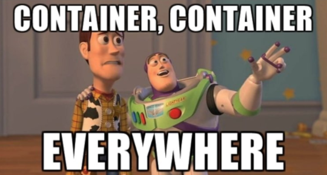
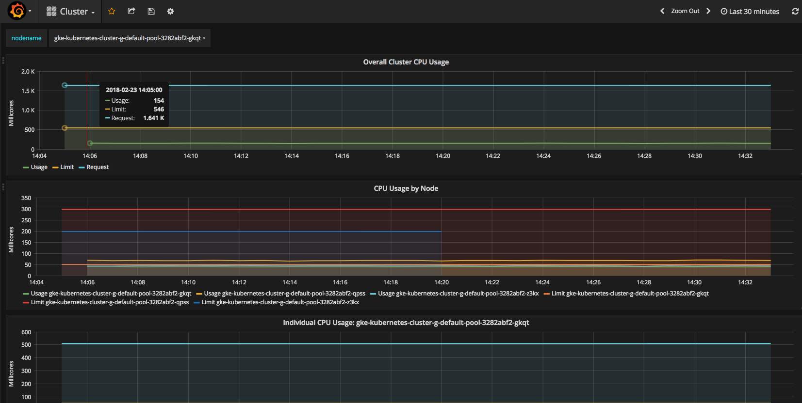

# Deploying Tensorflow Serving using Kubernetes Tutorial

### What this project is
This project is a tutorial that walks through the steps required to deploy and
[serve a TensorFlow model](https://www.tensorflow.org/serving/serving_basic)
using [Kubernetes (K8s)](https://kubernetes.io/).

The key concepts covered in this tutorial are as follows:

* Convert a TensorFlow(TF) graph trained through various APIs into a servable
model
* Dockerize your servable model and push it to a container registry
* Deploy your Docker container image onto a Kubernetes(K8s) cluster
* Deploy a external load balancer to receive requests and send to different
backend pods/nodes.
* Send online prediction requests to the cluster via a client.
* Profile latency and throughput. Experiment with different batch sizes.
* Visualize image pixel contributions to model predictions to explain how the
model sees the world.

### What this project is not

This tutorial is not meant to be the quickest path toward deploying TF
serving using Kubernetes. If you are looking for automated solutions to deploy
Tensorflow Serving for production, please check out
[Kubeflow](https://github.com/kubeflow/kubeflow), which automates many of the
Docker/K8s steps covered in this tutorial.

## Setup

Before the fun begins, we need to setup our environment and K8s clusters. 

As a developer, it often helps to create a local deployment prior to deploying
on the cloud. Local deployment is challenging in that one's local environment
varies significantly between individuals. It is up to the student to figure out
how to setup and validate the following required software for emulating a K8s
cluster locally. We offer some guides on setting up a local K8s cluster, as well
as setting up a cluster on Google Cloud Platform (GCP):

* [Local: Minikube](LOCAL_SETUP.md)
* [Cloud: Google K8s Engine](GKE_SETUP.md)

### Additional Required Software

**Note:** if you are running on GCP and wish to skip the tedious step of
installing software and running a notebook in your local environment, we've
provided [automated steps](GCP_VM_SETUP.md) to spinning up a virtual machine on
cloud and doing notebook and Docker exercises there. 

**For running the tutorial notebooks and Docker locally, follow the instructions
below**:

Install the following:

* [Python 2.7+ and 3.5+](https://www.python.org/): Since we are working with
Tensorflow and Python notebooks, we will need python. Make sure you have both
Python 2 and 3 installed as the notebook exercises require Python 3, but
Tensorflow serving is only supported in Python 2 currently.
* [Docker](https://www.docker.com/): to build images that can be deployed on K8s
* [Git](https://git-scm.com/): so you can access this project and other projects
* [Pip](https://pip.pypa.io/en/stable/installing/): to install Python packages
required for the tutorial

Use pip to install virtualenv so we can create virtual environments that will
not affect your system's default Python libraries:

```
pip install virtualenv
```

After installing all software, we need to checkout a few github projects.
In your command line, go to a directory where you wish you checkout projects.
Then run the following to checkout the v1.4.0 branch for Tensorflow models:

```
git clone https://github.com/tensorflow/models.git
cd models
git checkout v1.4.0 
```

Next, cd back to the parent directory and checkout our tutorial project:

```
cd ..
git clone https://github.com/google-aai/tf-serving-k8s-tutorial.git
cd tf-serving-k8s-tutorial
```

Next, set aside a path to build a Python3 virtual environment, and activate
the environment:
```
VIRTUAL_ENV_PATH=<path/to/environment>
```

```
virtualenv -p python3 ${VIRTUAL_ENV_PATH}
source ${VIRTUAL_ENV_PATH}/bin/activate
```

Within the virtual environment, install dependencies from the tutorial project,
and run the notebook:

```
pip install -r jupyter_requirements.txt
jupyter notebook
```

Congratulations! You may now start the exercises!

## Create a Servable Resnet Model from Estimator and Keras APIs

Now that all of the environment setup is out of the way, let’s create a servable
model!

**Exercises:**

In the window that contains your Jupyter notebook, open the notebook
[estimator_training_to_serving.ipynb](./estimator_training_to_serving.ipynb),
and work through the exercises in there to convert a model trained by the
[Tensorflow Estimator API](https://www.tensorflow.org/programmers_guide/estimators)
into a servable "saved model" format. You can also try out
[keras_training_to_serving.ipynb](./keras_training_to_serving.ipynb)
to do the same exercise with a prepackaged [Keras](https://keras.io/) model
trained/loaded with a Tensorflow backend. 

Note that we've chosen these two API as they are perhaps the most popular
abstractions of choice used by many ML researchers and practitioners. However,
one can also build a servable directly from a TF graph using
tf.saved_model.builder.SavedModelBuilder(). The exported model format will
be identical regardless of the API used, as long as there is specification for
how the model should receive input and return output.

If you are stuck, please refer to the solution notebooks for hints:
[estimator_training_to_serving_solution.ipynb](./estimator_training_to_serving_solution.ipynb)
and [keras_training_to_serving_solution.ipynb](./keras_training_to_serving_solution.ipynb).

## Unit Testing your Code

The Estimator and Keras notebooks demonstrate how one can refactor training
code into production code in order to perform unit testing. Additionally,
we have provided samples from the
[Tensorflow unit testing](https://www.tensorflow.org/api_guides/python/test) and
[Tensorflow Eager](https://research.googleblog.com/2017/10/eager-execution-imperative-define-by.html)
frameworks for the interested reader. These are both helpful tools to help you
debug Tensorflow functions that would otherwise be part of an end-to-end
Tensorflow graph. Note that unit testing is a more formal software engineering
framework, while Eager is more data science-driven (You can immediately validate
the result of running data through a Tensorflow graph as you construct it.)

## Validate your Servable Model

After successfully exporting your servable model to disk, it helps to verify
that the model can read the expected request format before proceeding to
Dockerize and deploying to a Kubernetes cluster. The notebook
[resnet_servable_validation.ipynb](resnet_servable_validation.ipynb) contains
code to validate that your servable Resnet model performs the right operations
in terms of input and output.

**Note:** if you plan to run on GPU and use data_format=“channels_first” in
the Estimator model for GPU deployment, please remember to start with
“channels_last” for this validation step, and then create a new model with
“channels_first” to test on your GPU cluster later on.


## Create a Model Server Docker Image

### Docker files and Docker images
Docker images are snapshots of a virtual environment (operating system,
installed software, files, etc.) and are often built on top of other Docker
images. For example, the Docker file `Dockerfile.cpu` has the following line:

```
FROM gcr.io/kubeflow/model-server:1.0
```

This line references an image `gcr.io/kubeflow/model-server:1.0` as a
starting point (base image) for building a new image. Additional commands can be
added in the docker file to modify the base image. This can include installing
new software, uploading files from your local environment, etc. When 
`docker build` is run, a new image will be created with these commands executed
on the base image.

Docker images are composed of many layers of images upon which
previous images are built. To make a new image accessible for deployment or for
further image builds, a locally built image will need to be pushed into a
*registry*, such as [Docker Hub](https://hub.docker.com/) or
[Google Container Registry](https://cloud.google.com/container-registry/).

### Docker file exercise


Now that you’ve created a servable model and saved it to a directory
`resnet_servable` under your project folder on your VM, you will build a
[Docker image](https://docs.docker.com/get-started/#images-and-containers).
Docker images are executable packages that contain everything needed to run an
application, e.g. code, runtime, libraries, environment variables, configuration
files, as well as the underlying OS. Images are often built on top of other
Docker images, which are built on top of other images, etc, much like version
control. For instance, [Dockerfile.cpu](./Dockerfile.cpu) contains the line:

```
FROM gcr.io/kubeflow/model-server:1.0
```

This means the image `gcr.io/kubeflow/model-server:1.0` is used as a base image,
and run additional commands (specified in the Docker file) to modify that image,
such as installing new software, uploading files from your local environment,
etc. Running `docker build` using this docker file will create a new
docker image that is the result of running these additional commands on the
image `gcr.io/kubeflow/model-server:1.0`.
 
**Note:** The base images provided in this lab come from the
[Kubeflow](https://github.com/kubeflow/kubeflow) and already contain a
TensorFlow Model Server installed as an executable. If you did not have such an
image available, you would have to build it from
[another Dockerfile](https://github.com/kubeflow/kubeflow/blob/master/components/k8s-model-server/images/Dockerfile.cpu),
and then using your newly built image as the base image for your final
Dockerfile.

**Exercise:**

In the same environment used to spawn your Jupyter notebook (local or cloud VM),
cd into the tutorial directory (i.e. `tf-serving-k8s-tutorial`), and setup a
shell variable for the next few steps. Choose the one that corresponds with
your Kubernetes deployment environment - you will either be deploying to a
cluster with CPUs or GPUs for serving:

```
MACHINE_TYPE=cpu|gpu
```

Next, edit your Docker file. Dockerfile.${MACHINE_TYPE} is currently incomplete.
Add your servable model folder to your image’s root directory “/”. (See this
page for usage of ADD command.) The final result should be that your image
contains a folder “resnet_servable” with a timestamp version subfolder and
other contents within it. 

**Note:** You are encouraged to remove any older versions of the model from your
resnet_serving directory in the docker to reduce the size of the docker
container; however, the TF model server will still run correctly even with
multiple model versions, as it will only pick up the latest (highest integer)
version.

After you are done editing your file, try building the Docker image. We've
created a versioning bash command below that will increment your build version
every time you build an image:

```
BUILD=1 #assign this only once
```

Then run this every time you build (For those running on a Google Cloud VM, make
sure to use `sudo` before every docker command below, since root permissions are
required to install, and therefore run, Docker.):

```
IMAGE=library/resnet-server-${MACHINE_TYPE}:${BUILD}
sudo docker build -t ${IMAGE} \
-f Dockerfile.${MACHINE_TYPE} .
BUILD=$[BUILD+1]
```

**Note:** If this is your first time building, you will notice that Docker
starts downloading and extracting numerous images, which is basically like a
version control system checking out all the diffs in your code repository!

Once the build succeeds, you can check that your directory contents were added
correctly to the image. Run the command below to run shell in your image:

```
docker run -it ${IMAGE} bash
```

Inside this shell you can `cd resnet_servable` and check that the
version/timestamp folder and other files are in there. To exit this shell,
type `exit`. If you are stuck, you can always use the solutions dockerfiles
([Dockerfile.cpu-solution](./Dockerfile.cpu-solution) and
[Dockerfile.gpu-solution](./Dockerfile.gpu-solution)).

## Pushing the Docker Image to a Container Engine



In order to make your Dockerfile accessible to other machines (and your
Kubernetes cluster), you must upload your image to a
[Docker registry](https://docs.docker.com/registry/).

### Local Minikube Container Engine

If you already followed the setup instructions for
docker and minikube, you should have a Docker container engine running on
minikube that has ssh port forwarding to localhost.
You can push to localhost:5000:

```
docker tag library/resnet-server localhost:5000/${IMAGE}
docker push localhost:5000/${IMAGE}
```

You can now deploy containers from this address to your Minikube cluster!

### Google Container Engine

Double check that your project settings are correct:

```
gcloud config list project
```

Take your project name and set it to your bash variable:

```
PROJECT=<your-project-name>
```

Tag your docker image and push it to the Google Cloud container registry using
the `gcloud docker` command:

```
docker tag ${IMAGE} gcr.io/${PROJECT}/${IMAGE}
gcloud docker -- push gcr.io/${PROJECT}/${IMAGE}
```

In your [console view](https://console.cloud.google.com), click on the dropdown
menu under TOOLS → container registry → images, and you should notice a nested
folder “library/resnet-server-${MACHINE_TYPE}” that contains the ${BUILD}
version in there. Your image is now stored at an address:

gcr.io/${PROJECT}/library/resnet-server-${MACHINE_TYPE}:${BUILD}

You can now use this image address to deploy to a Kubernetes cluster!

## Deploy the Image to Kubernetes

In this section you will edit a configuration file to deploy the image uploaded
to your registry onto a Kubernetes(K8s) cluster. During deployment, K8s will
create [pods](https://kubernetes.io/docs/concepts/workloads/pods/pod/) in the
backend. In our case, each pod will host only a single container image and
therefore, only one application, namely, the TensorFlow Model Server.

By default, pods are not exposed to outside traffic. Instead, we will deploy a
frontend [service](https://kubernetes.io/docs/concepts/services-networking/service/)
to redirect traffic to backend pods. The redirection is accomplished through the
use of [selectors and labels](https://kubernetes.io/docs/concepts/overview/working-with-objects/labels/), and 
[load balancing](https://kubernetes.io/docs/tasks/access-application-cluster/create-external-load-balancer/)
as determined by the cloud provider.

**Exercise:**

We are going to create a simple deployment with 2 pods in the backend, and 1
load balancer service in the frontend.

Make sure that you have the tutorial checked out in your cloud control
environment. This would either be your local command line, or the cloud shell
 window under your console page.

```
cd ~/tf-serving-k8s-tutorial
```

Copy the file [k8s_resnet_serving_template.yaml](./k8s_resnet_serving_template.yaml)
over and fix the TODO lines:

```
cp k8s_resnet_serving_template.yaml k8s_resnet_serving.yaml
# Run vi/emacs/nano/notepad k8s_resnet_serving.yaml
```

**Note:** the yaml file specifies a LoadBalancer service, and a backend
deployment of pods with different types and amounts of resources on your cluster
(i.e. gpu if you are on a gpu machine). If your cluster has insufficient
resources for the number of replicas (pods) specified in the config file,
Kubernetes will only spin up a number of pods based on what is available.

Once you are done editing the config file, run the following to deploy your pods
and the load balancer service to your cluster:

```
kubectl apply -f k8s_resnet_serving.yaml
```

You can now check on the progress of  your pod deployment by running:

```
kubectl get pods
```

The pods should take a couple of minutes to deploy. Proceed after they are in
`Running` state, e.g.

```
NAME                                 READY     STATUS    RESTARTS   AGE
resnet-deployment-86b9d9b784-2kdt8   2/2       Running   0          3m
```

You can also check what services are available:

```
kubectl get svc
```

Your output should look something like the display below. Notice that there is a
LoadBalancer service that will eventually expose an external-ip and a public
port (9000).

```
NAME             TYPE           CLUSTER-IP     EXTERNAL-IP    PORT(S)          AGE
kubernetes       ClusterIP      aa.bb.cc.dd    <none>         443/TCP          30m
resnet-service   LoadBalancer   xx.yy.zz.ww    XX.YY.ZZ.WW    9000:30867/TCP   1m
```

You can now make client calls to the service “resnet-service” using the exposed
IP and port!

**Debugging:** Occasionally, things can go wrong with deployment. If you have
trouble getting your pods to run properly, you can display logs from each pod by
running:

```
kubectl logs <pod-name>
```

Usually, the mistake can be as simple as pointing to the wrong directory for
your model.

To redeploy your model, simply edit your yaml (e.g., update the version number)
and reapply the deployment. Note that the deployment section of the file needs
to be changed in order for the configuration to be redeployed:

```
kubectl apply -f k8s_resnet_serving.yaml
```

For additional kubectl basic commands, [see here](KUBECTL_BASICS.md).

## TF Client

In your Jupyter/Docker-building environment (either local or the
jupyter-and-docker-vm on cloud), create a *Python 2* virtual environment.

```
deactivate  # Run only if you need to exit the Python 3 virtual environment.
virtualenv <path/to/client-virtualenv>
source <path/to/client-virtualenv>/bin/activate
```

cd into the tutorial project directory (`tf-serving-k8s-tutorial`), and run:

```
pip install -r client_requirements.txt
```

Then cd into the client directory within the tutorial project:

```
cd client
```

To run the client, enter the command:

```
python resnet_client.py --server <load-balancer-external-ip> \
  --port 9000 \
  <image-path-or-url-1> <image-path-or-url-2> ...
```

For the external-ip, if you are using minikube, the ip should be `localhost`.
If you are running on Google Cloud, you can find the ip by running
`kubectl get svc`.

For the image paths and/or urls, you can use the cat_sample.jpg in the current
directory, or you find some RGB pictures online, such as:
https://www.popsci.com/sites/popsci.com/files/styles/1000_1x_/public/images/2017/09/depositphotos_33210141_original.jpg?itok=MLFznqbL&fc=50,50


### Profiling Latency

**Exercise:**: Look at the profiler [resnet_profiler.py](client/resnet_profiler.py).
Try sending requests with the profiler and compute latency and throughput.
Latency is simply the round trip delay returned by the profiler. An
approximation of throughput is the number of batches divided by latency when a
large batch size is used. Try varying batch sizes between 1 and 256.

What do you notice about CPU/GPU performance with different batch sizes?

**Remark:** Profiling is a very important step when you are trying to setup a
robust server. GPUs are great performers, but stop providing gains after a
certain batch size. Furthermore, servers can run out of memory, in which case TF
serving often crashes silently, i.e. `kubectl logs <pod>` won't return anything
useful. When you deploy your own Kubernetes system, you will need to ensure that
your machine can load your model and process requested batch sizes.

## Scaling up your application

If you wish to scale up your deployment without shutting down the currently
deployed pods, you can run:

```
kubectl scale --replicas=<num-pods> deployment/resnet-deployment
```

When you direct a client request to the load balancer, it will use
an elastic search algorithm to assign your request to one of the backend pods.

**Challenge**: We’ve defaulted the deploying to exactly 2 pods, but your server
isn’t always busy. Deploying a cluster on cloud, especially with GPU, can be
expensive! Can you modify your yaml configuration to create an auto-scaling
deployment? (See [here](https://kubernetes.io/docs/tasks/run-application/horizontal-pod-autoscale/).)

## Google K8s Engine: Auto-refreshing the model version

Google Cloud K8s Engine offers a special feature! Suppose your ML researcher has
a new and improved Resnet model, or even a new
architecture (e.g. 152-layers!). Tensorflow serving has the feature of
immediately picking up the newest version of a servable model in your servable
directory, and serving it immediately! All you need to do is make sure that
the numeric identifier (the directory inside your serving model directory,
default is unix timestamp) is greater than the previous version. You can use
an updated notebook to export a new servable model.
  
Unfortunately, building a new docker image requires you to redeploy your
containers/pods, which interrupts your service. However, Google Kubernetes
Engine has access to Google Storage as well, so you can reference a storage
bucket as your model path and simply add/update the directory on the bucket
itself! To test this out, select a bucket name:

```
BUCKET=<your-bucket-name>
```

and then create it:

```
gsutil mb gs://${BUCKET}
```

Upload your servable model  directory to the bucket:

```
gsutil -m cp -r /local/path/to/servable_dir gs://${BUCKET}/<servable-dir>
```

Now edit your yaml file to point your model path to your Google Storage
directory. Any time you upload a new model version into that directory, TF model
server should pick it up.

## Profiling with Kubernetes Heapster


(This exercise is more interesting if done on cloud, but can be made to work on
Minikube as well.)

[Kubernetes Heapster](https://github.com/kubernetes/heapster) is an open-sourced
project that can be installed as a service on any Kubernetes cluster. It creates
a Grafana dashboard that is integrated with various backend DBs that store data
about the cluster or its nodes (e.g. cpu usage, memory). By default, influxDB
is used for storing the data. 

**Exercise 1:**
From your cloud controller environment (local or cloud shell
 under the console), cd out of your
project directory (e.g. go to the parent directory of the tutorial project), and
run:

```
git clone https://github.com/kubernetes/heapster
cd heapster
```

Next follow the instructions at
https://github.com/kubernetes/heapster/blob/master/docs/influxdb.md 
Note that running the “kubectl create” lines may return errors on Google K8s
Engine since the heapster service may already exists on Cloud, but other
components such as “monitoring-grafana”, which are necessary for this exercise,
will be deployed. The goal is to get a grafana dashboard up and running. By
default, the dashboard will monitor individual pods as well as aggregate cluster
metrics, such as CPU usage.



Heapster will be running in the namespace `kube-system`. To see what processes are running there, enter:

```
kubectl get services --namespace=kube-system
```

**Note:** To access the grafana dashboard, you will need to give the
monitoring-grafana service an external IP! To do this, you will need to change
the service type to LoadBalancer.

**Hint:** Use “kubectl edit svc …”
If you followed all the steps correctly, you should be able to access the
Grafana dashboard and discover Cluster and Pods in the dropdown menu at the top left.

**Exercise 2:**
Try running the profiler client from your VM ssh shell. Create a job with
multiple iterations and replications which runs for a couple of minutes. Which
pods are receiving requests, and how are requests distributed? What happens if
you make multiple client calls simultaneously? How are the requests being load
balanced in the backend?

```
for i in {1..10}
do
  python resnet_profiler.py ...  &
done
```

**Remark #1:** The TensorFlow Model Server is primarily used for online
predictions. Due to caching in the TensorFlow Serving api code, if a client
sends multiple requests to a server, it will always use the same connection to
the same server and hence, the same backend pod! However, if online prediction
requests are coming from many processes or nodes, they will be spread out across
all pods in the cluster.

**Remark #2:** Heapster currently does not support GPU profiling. However,
[cAdvisor](https://github.com/google/cadvisor) (a daemon used by Kubernetes to
collect, aggregate, and export container data) has recently introduced GPU
profiling. If you are running on Google Cloud,
[Stackdriver](https://cloud.google.com/stackdriver/) also enables GPU
monitoring.

## Model Understanding and Visualization

As a bonus feature, we offer ways to validate a served model through
visualization! Run this notebook:

```
resnet_model_understanding.ipynb
```

The notebook runs a visualization of pixels that are important in determining
that the image belongs to a particular class. More specifically, the visible
pixels correspond to the highest partial derivatives of the logit of the most
probable class as a function of each pixel, integrated over a path of image
pixels from a blank image (e.g. all grey pixels) to the actual image.
The visualization is based on a recent research paper by M. Sundararajan,
 A. Taly, and Q. Yan: [Axiomatic Attribution for Deep Networks](https://arxiv.org/pdf/1703.01365.pdf).

## Additional Resources

### General Disclaimers and Pitfalls

* Tensorflow Server is written in c++, so any Tensorflow code in your
model that has python libraries embedded in it (e.g. using tf.py_func()) will
FAIL! 
* Security is an issue in this tutorial! Simply changing your model server to a
`LoadBalancer` to open up a tcp port for serving is not secure! If you are
running on cloud, you will need to enable secure identity for your K8s cluster,
such as Google Cloud IAP.
[See the Kubeflow IAP documentation](https://github.com/kubeflow/kubeflow/blob/master/docs/gke/iap.md)
for more information. 

### KSonnet and Kubeflow

* [Kubeflow](https://github.com/kubeflow/kubeflow) automates Kubernetes
deployments for TF notebook, model training (distributed and GPU), and model
serving. Much of this tutorial's content (i.e. deploying TF serving) can be
automated using their solutions. Please check out their project and contribute
to the discussion!
* [ksonnet.io](https://ksonnet.io/tour/welcome) Ksonnet allows you to define
functions that take in parameters that determine
the value of fields set in your yaml file. Furthermore, these parameter values
can be configured at the command line for different environments. Try out their
tutorial!


